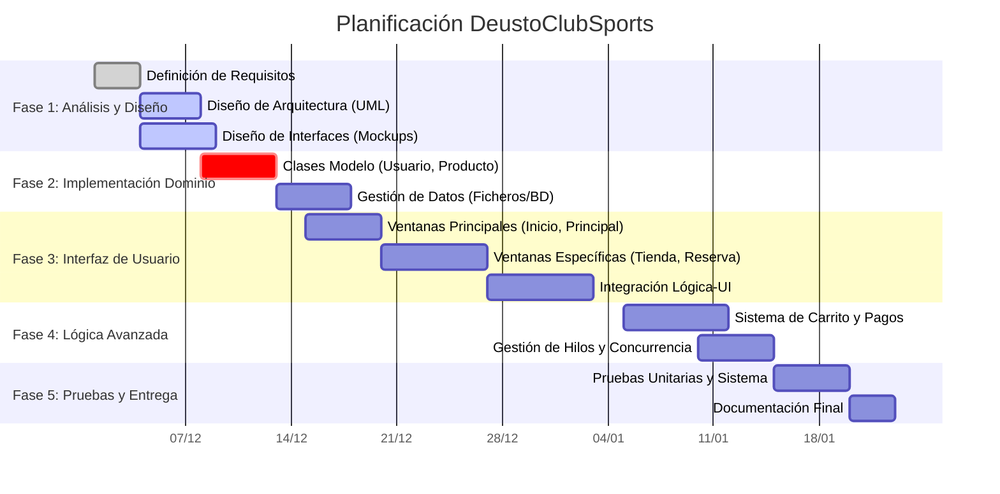
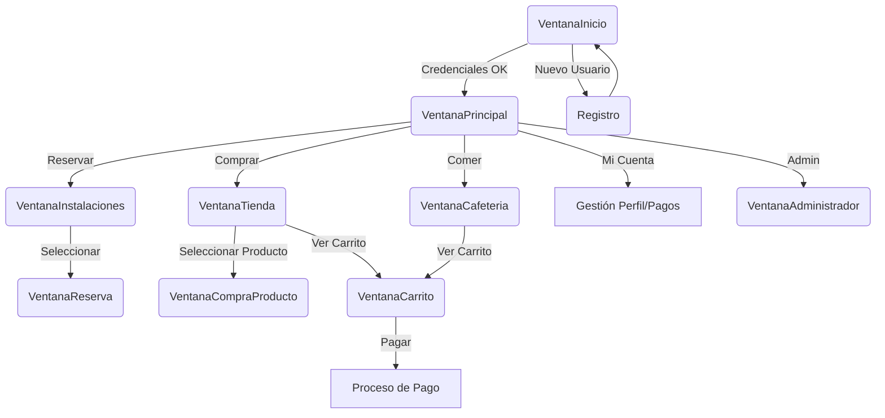

# Documentación del Proyecto: DeustoClubSports

## 1. Idea Detallada del Proyecto

**DeustoClubSports** es una aplicación de escritorio desarrollada en Java que tiene como objetivo gestionar las actividades y servicios de un club deportivo. La aplicación está diseñada para facilitar tanto a los usuarios (socios) como a los administradores la gestión de las instalaciones, compras y reservas.

El sistema permite a los usuarios:
- **Registrarse e Iniciar Sesión**: Acceso seguro mediante credenciales.
- **Reservar Instalaciones**: Visualizar pistas deportivas disponibles y realizar reservas.
- **Tienda y Cafetería**: Comprar equipamiento deportivo y productos de cafetería.
- **Gestión de Compras**: Añadir productos a un carrito y procesar el pago.
- **Gestión de Cuotas**: Realizar el pago de las cuotas de socio.

Para los administradores, el sistema ofrece una interfaz dedicada (`VentanaAdministrador`) para gestionar usuarios, reservas y el inventario de productos.

## 2. Planificación Inicial (Gantt)

A continuación se presenta una planificación inicial del proyecto dividida por fases.

## 3. Funcionalidades Destacadas

1.  **Géstión de Usuarios y Seguridad**:
    *   Registro de nuevos usuarios con validación de datos.
    *   Login seguro para usuarios y administradores.
    *   Perfil de usuario editable.

2.  **Sistema de Reservas**:
    *   Selección de tipo de deporte (Fútbol, Baloncesto, Tenis, etc.).
    *   Visualización de horarios disponibles.
    *   Confirmación de reserva vinculada al usuario.

3.  **E-commerce (Tienda y Cafetería)**:
    *   Catálogo de productos (Ropa, Accesorios, Comida, Bebida).
    *   **Carrito de Compra**: Permite acumular productos (`ItemCarrito`) y calcular el total.
    *   Proceso de checkout simulado.

4.  **Panel de Administración**:
    *   Control total sobre los datos de la aplicación (Usuarios, Productos).
    *   Capacidad para dar de baja usuarios o cancelar reservas.

## 4. Boceto de Interfaces

La navegación de la aplicación sigue una estructura jerárquica a partir de una ventana principal.

### Flujo de Navegación

### Descripción de Ventanas Clave

*   **VentanaInicio**: Pantalla de bienvenida con campos para usuario y contraseña. Botón para ir a `Registro`.
*   **VentanaPrincipal**: Dashboard central con botones grandes o un menú para acceder a las secciones principales (Instalaciones, Tienda, Cafetería).
*   **VentanaInstalaciones**: Muestra una lista o rejilla con las instalaciones disponibles. Filtros por deporte.
*   **VentanaReserva**: Formulario para seleccionar fecha y hora. Muestra confirmación.
*   **VentanaTienda / VentanaCafeteria**: Catálogo visual con imágenes de productos, nombre y precio.
*   **VentanaCarrito**: Tabla resumen de productos seleccionados, cantidades y precio total. Botón para finalizar compra.
